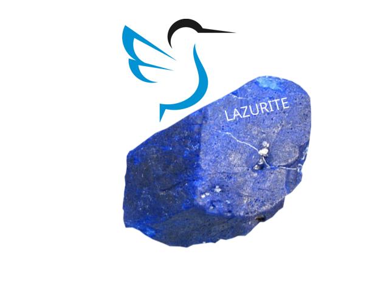

<!-- PROJECT LOGO -->
<br />
<p align="center">

  <a href="https://github.com/GuzhavinAleksey/fedora-lazurite">
    
  </a>

  <h3 align="center">Fedora Lazurite</h3>


<!-- TABLE OF CONTENTS -->                                                                                                                                                                  
## Table of Contents

* [About the Project](#about-the-project)
* [Specification](#specification)
* [Getting Started](#getting-started)
  * [Installation](#installation)
  * [Build and installation](#Build_and_installation)
  * [Manifests](#Manifests)
* [FAQ](#FAQ)
* [Thanks](#Thanks)
* [License](#license)
* [Contact](#contact)


<!-- ABOUT THE PROJECT -->
## About The Lazurite
![Product Name Screen Shot][product-screenshot]
Fedora Lazurite is an immutable desktop operating system. It aims to be extremely stable and reliable. based on fedora stable release. It also aims to be an excellent platform for developers and for those using container-focused workflows.
Name inspired by the forum: [https://discussion.fedoraproject.org/t/introducing-fedora-silverblue-xfce-lxqt-i3-wm/30077](https://discussion.fedoraproject.org/t/introducing-fedora-silverblue-xfce-lxqt-i3-wm/30077)
<!-- Specification -->
## Specification

Fedora Lazurite is a variant of the Fedora LXQt Spin. It looks, feels and behaves like a regular desktop operating system, provides a lightweight, well-integrated LXQt desktop environment, and the experience is similar to what you find with using a standard Fedora LXQt Spin.
However, unlike other operating systems, Fedora Lazurite is immutable. This means that every installation is identical to every other installation of the same version. The operating system that is on disk is exactly the same from one machine to the next, and it never changes as it is used.

Fedora Lazurite’s immutable design is intended to make it more stable, less prone to bugs, and easier to test and develop. Finally, Fedora Lazurite’s immutable design also makes it an excellent platform for containerized applications as well as container-based software development. In each case, applications (apps) and containers are kept separate from the host system, improving stability and reliability.

Fedora Lazurite’s core technologies have some other helpful features. OS updates are fast and there’s no waiting around for them to install: just reboot as normal to start using the next version. With Fedora Lazurite, it is also possible to roll back to the previous version of the operating system, if something goes wrong.
Added packages for system customization:

* kvantum 
* plasma-systemsettings
* kwin-x11 ( add to autorun /usr/bin/kwin_x11 --replace )
* kwin-wayland


<!-- GETTING STARTED -->
## Getting Started
As Lazurite is not yet an official Fedora edition, there is not a dedicated installer for it for now. To get started, install Silverblue [https://docs.fedoraproject.org/en-US/fedora-silverblue/installation/](https://docs.fedoraproject.org/en-US/fedora-silverblue/installation/) and switch to Lazurite with the following commands


### Installation

1. Add the temporary unofficial Lazurite remote
```sh
sudo ostree remote add lazurite https://lazurite.guzhavin.com/repo --no-gpg-verify
```
2. Optional, only if you want to keep Silverblue available
```sh
sudo ostree admin pin 0
```
3. Switch to Lazurite
```sh
sudo rpm-ostree rebase lazurite:fedora/37/x86_64/lazurite
```
4. Reboot
```sh
sudo systemctl reboot
```
5. To update the system
```sh
rpm-ostree update
```
6. To update Flatpaks
```sh
flatpak update
```
### Build_and_installation

1. Clone the config
```sh
git clone https://github.com/GuzhavinAleksey/fedora-lazurite.git && cd fedora-lazurite
```
2. Prepare directories
```sh
mkdir -p repo cache
ostree --repo=repo init --mode=archive
```
3. Build (compose)
```sh
sudo rpm-ostree compose tree --unified-core --repo=repo --cachedir=cache fedora-lazurite.yaml
```
4. Update summary file
```sh
ostree summary --repo=repo --update
```
5. Testing
Instructions to test the resulting build:

- First, serve the ostree repo using an HTTP server. You can use any static file server. For example using <https://github.com/TheWaWaR/simple-http-server>:
	@@ -108,63 +52,38 @@ Instructions to test the resulting build:
  simple-http-server --index --ip 192.168.122.1 --port 8000
  ```

- Then, on an already installed Lazurite system:

6. Add the temporary unofficial Lazurite remote
```sh
sudo ostree remote add lazurite_local http://<IP_ADDRESS>/repo --no-gpg-verify
```
7. Optional, only if you want to keep Lazurite available
```sh
sudo ostree admin pin 0
```
8. Switch to Lazurite
```sh
sudo rpm-ostree rebase lazurite_local:fedora/37/x86_64/lazurite
```
9. Reboot
```sh
sudo systemctl reboot
```
10. To update the system
```sh
rpm-ostree update
```
11. To update Flatpaks
```sh
flatpak update
```
<!-- Manifests -->
## Manifests
rpm-ostree manifests used to build Fedora Lazurite, Kinoite [https://pagure.io/workstation-ostree-config](https://pagure.io/workstation-ostree-config) <!-- Thank_you -->

## FAQ
1. To remove the pinned deployment use following command (2 corresponds to the entry position in rpm-ostree status):
```sh
sudo ostree admin pin --unpin 2
```
2. How to revert
```sh
rpm-ostree rollback
```
3. If you have rpm-fusion layered on your Lazurite,Kinoite,Silverblue installation, you should do the following before rebase
```sh
rpm-ostree update --uninstall rpmfusion-free-release --uninstall rpmfusion-nonfree-release --install rpmfusion-free-release --install rpmfusion-nonfree-release
```
## Thanks
All the work is done [https://github.com/travier](https://github.com/travier) thanks to him, I will take care of the support of Fedora Silverblue with the LXQt desktop

<!-- LICENSE -->
## License

Distributed under the MIT License. See `LICENSE` for more information.

<!-- CONTACT -->
## Contact


Project Link: [https://github.com/GuzhavinAleksey/fedora-lazurite](https://github.com/GuzhavinAleksey/fedora-lazurite)
Author Link: [https://github.com/GuzhavinAleksey](https://github.com/GuzhavinAleksey)

<!-- IMAGES -->
[product-screenshot]: lazurite-im.png
